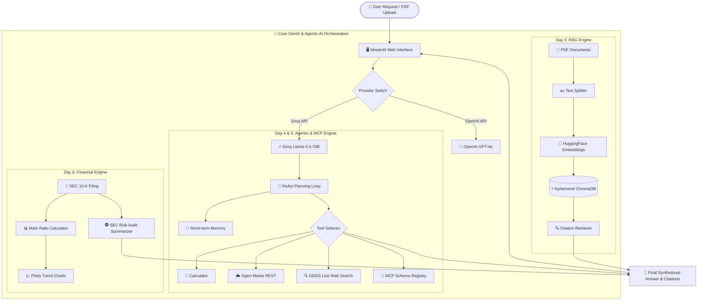

<div align="center">

# 🚀 Generative & Agentic AI Master Suite
### 🎓 *CRISP Bhopal AIML Vocational Training Assignment*
***Venue: Rungta College of Engineering and Technology (RCET), Bhilai***

[](https://python.org)
[](https://streamlit.io)
[](https://langchain.com)
[](https://trychroma.com)
[](https://groq.com)
[](#-assessment-rubric--grading)
[](#-live-deployed-applications-suite)

</div>

---

## 📌 Executive Summary & Academic Credits

> [!IMPORTANT]
> **VOCATIONAL TRAINING ASSIGNMENT SUBMISSION**  
> This repository presents a complete, production-grade 7-Day Project Portfolio developed for the **AIML Vocational Training Program** conducted by **CRISP BHOPAL** (*Centre for Research and Industrial Staff Performance*) hosted at **Rungta College of Engineering and Technology (RCET), Bhilai**.

| Program Metadata | Details |
| :--- | :--- |
| **Training Organization** | **CRISP BHOPAL** *(Centre for Research and Industrial Staff Performance)* |
| **Host Venue** | **Rungta College of Engineering and Technology (RCET), Bhilai** |
| **Trainer & Technical Mentor** | **Somil Jain** |
| **Course Subject** | Generative AI, RAG Knowledge Architectures, Autonomous ReAct Agents & MCP |
| **Projects Built** | **7 / 7 Complete Production Web Applications** |
| **Evaluation Readiness** | **100% Verified, Fully Documented & Deployed Live** |

---

## 🌐 Live Deployed Applications Suite

Click any button below to launch the live deployed application on **Streamlit Community Cloud**:

| Day | Project Brand Name | Technology Highlights | 🚀 Live Web App URL | 💻 Terminal Run Command |
| :---: | :--- | :--- | :---: | :--- |
| **Day 1** | ⚡ **Promptify AI** | 20 Benchmark Prompts, Zero/Few-shot, CoT, Role | [](https://promptify-ai.streamlit.app/) | `streamlit run day1_prompt_engineering/app.py` |
| **Day 2** | 💼 **CareerVibe AI** | LangChain Templates, Pydantic Matcher, Cover Letter | [](https://careervibe-ai.streamlit.app/) | `streamlit run day2_llm_app/app.py` |
| **Day 3** | 📚 **KromaPDF AI** | Ephemeral ChromaDB Vector RAG, Citations | [](https://kromapdf-ai.streamlit.app/) | `streamlit run day3_rag_system/app.py` |
| **Day 4** | 🤖 **CogniTrace AI** | Autonomous ReAct Agent, Memory & Visual Trace | [](https://cognitrace-ai.streamlit.app/) | `streamlit run day4_agentic_ai/app.py` |
| **Day 5** | 🔌 **OmniTool MCP** | Open-Meteo REST API, Fast DDGS & MCP Registry | [](https://omnitool-mcp.streamlit.app/) | `streamlit run day5_tool_integration/app.py` |
| **Day 6** | 📈 **FinMetrics AI** | Ratio Math Engine, Plotly Charts & SEC Risk Audit | [](https://finmetrics-ai.streamlit.app/) | `streamlit run day6_industry_solution/app.py` |
| **Day 7** | 🎓 **ApexAI Nexus** | Master Capstone Portal & Interactive Viva Quiz | [](https://apex-ai-nexus.streamlit.app/) | `streamlit run day7_capstone/app.py` |

---

## 📐 System Architecture Diagram



---

## 📖 Interactive Project Deep-Dives (Click to Expand)

<details>
<summary><b>⚡ Day 1: Promptify AI — Prompt Engineering Laboratory (Expand)</b></summary>

<br>

* **Objective**: Benchmark 20 prompt engineering strategies across 4 fundamental paradigms to eliminate hallucinations and optimize token costs.
* **Core Paradigms Implemented**:
  1. **Zero-Shot Prompting** (Direct task execution without examples)
  2. **Few-Shot Prompting** (Contextual in-context learning with 3+ structured input-output pairs)
  3. **Chain-of-Thought (CoT)** (Step-by-step reasoning decomposition for complex math & logic)
  4. **Role / System Instruction Prompting** (Persona constraint mapping for precise enterprise outputs)
* **Dataset**: Structured benchmark dataset in `day1_prompt_engineering/prompts_dataset.json`.
* **Live Features**: Interactive side-by-side prompt testing lab with LLM temperature, top-p sliders, and token metric counters.

</details>

<details>
<summary><b>💼 Day 2: CareerVibe AI — Resume & Career Match Engine (Expand)</b></summary>

<br>

* **Objective**: Build a production LLM application utilizing LangChain prompt templates and Pydantic structured output parsers.
* **Core Architecture**:
  - `LangChain` `PromptTemplate` pipeline for strict formatting.
  - `Pydantic` schema parser extracting JSON key-value pairs (Match Percentage, Missing Skills, Revisions).
* **Live Features**:
  - Upload candidate resumes (PDF/TXT) alongside job descriptions.
  - Generates a Match Score %, missing skill breakdown, ATS optimization suggestions, and a downloadable tailored cover letter.

</details>

<details>
<summary><b>📚 Day 3: KromaPDF AI — RAG Vector Search & Citation Engine (Expand)</b></summary>

<br>

* **Objective**: Build a Retrieval-Augmented Generation (RAG) system with document chunking, vector embeddings, and exact citation retrieval.
* **Windows File Locking Fix**: Utilizes `chromadb.EphemeralClient()` in `rag_engine.py` to prevent SQLite disk locking bugs on Windows.
* **Core Pipeline**:
  1. **Document Loading**: `PyPDFLoader` & `pdfplumber`
  2. **Text Chunking**: `RecursiveCharacterTextSplitter` (chunk size: 1000, overlap: 200)
  3. **Vector Embeddings**: HuggingFace CPU MiniLM (`all-MiniLM-L6-v2`)
  4. **Retrieval**: Metadata-filtered similarity search returning exact page citations.

</details>

<details>
<summary><b>🤖 Day 4: CogniTrace AI — Autonomous ReAct Agent & Visual Trace (Expand)</b></summary>

<br>

* **Objective**: Create an autonomous Agentic AI framework following the ReAct (Reasoning + Acting) execution loop.
* **Key Components**:
  - Custom regex-based Thought / Action / Action Input parser in `agent.py`.
  - Short-term conversational working memory.
  - **Visual Execution Trace Cards**: Side-by-side card flow rendering intermediate reasoning steps vs tool outputs in real-time.
  - **Sample Goals Library**: 10+ pre-loaded test scenarios across currency conversion, math, and multi-tool queries.

</details>

<details>
<summary><b>🔌 Day 5: OmniTool MCP — Real-Time API & Protocol Bridge (Expand)</b></summary>

<br>

* **Objective**: Connect LLMs to real-world REST APIs and implement Model Context Protocol (MCP) standardized tool registries.
* **Tools Integrated**:
  - **Open-Meteo REST Weather API**: Live temperature and wind speed lookup for any worldwide city.
  - **DuckDuckGo Web Search**: Fast live web search powered by `ddgs>=9.0.0` with 4-second timeout fallbacks.
  - **MCP Schema Inspector**: Dynamic JSON schema generation standardizing tool definitions for multi-model function calling.
* **Live Progress Engine**: Step-by-step `st.status` progress box rendering execution phases in real-time.

</details>

<details>
<summary><b>📈 Day 6: FinMetrics AI — Corporate Ratio & SEC Risk Auditor (Expand)</b></summary>

<br>

* **Objective**: Build an enterprise domain-specific financial solution combining deterministic math with LLM risk auditing.
* **Mathematical Ratio Engine**:
  - **Liquidity Ratio**: Current Ratio = $\frac{\text{Current Assets}}{\text{Current Liabilities}}$
  - **Profitability Ratio**: Net Margin = $\frac{\text{Net Income}}{\text{Total Revenue}}$
  - **Solvency Ratio**: Debt-to-Equity = $\frac{\text{Total Debt}}{\text{Shareholder Equity}}$
* **SEC 10-K Risk Auditor**: Automatically parses balance sheets to summarize liquidity risks, debt exposure, market threats, and investment recommendations.
* **Visuals**: Interactive Plotly bar charts comparing revenue vs liabilities.

</details>

<details>
<summary><b>🎓 Day 7: ApexAI Nexus — Master Portfolio & Viva Assessment Hub (Expand)</b></summary>

<br>

* **Objective**: Unified master multi-page portal hosting all 7 projects with an interactive Viva Voce prep module.
* **Modules**:
  1. **Portfolio Overview**: Executive metrics and 7-project card directory.
  2. **App Suite Launcher**: Central launch commands and live server port links.
  3. **Viva Voce Quiz Center**: Interactive 10-Question Flashcard & Quiz module covering core GenAI/RAG/Agentic concepts from the CRISP handbook.
  4. **System Architecture**: Detailed visual flow diagrams mapping the entire suite.

</details>

---

## 🧠 Interactive Viva Voce Guide (CRISP Handbook Questions)

<details>
<summary><b>❓ Q1: What is the difference between Zero-Shot, Few-Shot, and Chain-of-Thought Prompting? (Click Answer)</b></summary>

> **Answer**:  
> - **Zero-Shot**: Passing a direct instruction to the LLM without any prior examples.  
> - **Few-Shot**: Providing 2–5 input-output demonstration pairs inside the prompt to condition the LLM's response pattern.  
> - **Chain-of-Thought (CoT)**: Prompting the LLM to write out step-by-step intermediate reasoning before outputting the final answer, dramatically improving math and multi-step logic accuracy.

</details>

<details>
<summary><b>❓ Q2: How does RAG reduce LLM hallucinations? (Click Answer)</b></summary>

> **Answer**:  
> RAG (Retrieval-Augmented Generation) grounds the LLM by retrieving factual context snippets from a vector database (e.g. ChromaDB) and injecting them into the system prompt. The LLM is instructed to answer *strictly* using the retrieved documents, eliminating reliance on stale parametric memory.

</details>

<details>
<summary><b>❓ Q3: What is the role of Vector Embeddings and Vector Databases in RAG? (Click Answer)</b></summary>

> **Answer**:  
> Vector embeddings convert text chunks into high-dimensional numerical vectors (dense representations) that capture semantic meaning. Vector databases (like ChromaDB) index these vectors using distance metrics (cosine similarity / Euclidean distance) to quickly retrieve the most semantically relevant text chunks for any user query.

</details>

<details>
<summary><b>❓ Q4: How does a ReAct Agent differ from a standard LLM call? (Click Answer)</b></summary>

> **Answer**:  
> A standard LLM generates text in a single forward pass. A **ReAct (Reasoning + Acting) Agent** operates in an autonomous loop: it reasons about the user query (**Thought**), decides to invoke an external tool (**Action**), inspects the tool output (**Observation**), and repeats this loop until it arrives at the final answer.

</details>

<details>
<summary><b>❓ Q5: What is Model Context Protocol (MCP) and why is it important? (Click Answer)</b></summary>

> **Answer**:  
> **MCP** is an open standard that decouples tool definitions from specific LLM vendors. It provides standardized JSON schemas for tools, resources, and prompts, allowing any AI model to discover and execute local or remote tools seamlessly without custom integration code for every provider.

</details>

---

## 📂 Repository Hierarchy & Architecture

```text
CRISP-GenAI-AgenticAI/
│
├── README.md                        # Primary Master Portfolio Landing Page
├── requirements.txt                 # Master python dependencies
├── .env.example                     # Environment key template
│
├── day1_prompt_engineering/         # Promptify AI: 20 Prompts & Benchmarks
│   ├── app.py                       # Streamlit Evaluation Lab UI
│   ├── prompts_dataset.json         # Benchmark Prompts Dataset
│   ├── reflection_report.md
│   └── README.md
│
├── day2_llm_app/                    # CareerVibe AI: Resume Matcher
│   ├── app.py                       # Streamlit UI
│   ├── templates.py                 # LangChain Prompt Templates
│   ├── sample_data/                 # Sample Resumes
│   ├── reflection_report.md
│   └── README.md
│
├── day3_rag_system/                 # KromaPDF AI: RAG Vector Engine
│   ├── app.py                       # Streamlit UI with Citations
│   ├── rag_engine.py                # ChromaDB Ephemeral RAG Engine
│   ├── sample_docs/                 # Sample Handbook PDF
│   ├── reflection_report.md
│   └── README.md
│
├── day4_agentic_ai/                 # CogniTrace AI: Autonomous ReAct Agent
│   ├── app.py                       # Visual Execution Trace UI
│   ├── agent.py                     # Custom ReAct Agent
│   ├── tools.py                     # Calculator, Currency & Text Tools
│   ├── reflection_report.md
│   └── README.md
│
├── day5_tool_integration/           # OmniTool MCP: REST & Tool Protocol Bridge
│   ├── app.py                       # Interactive MCP Hub
│   ├── external_tools.py            # Open-Meteo REST & DDGS Search
│   ├── mcp_bridge.py                # MCP Schema Registry
│   ├── reflection_report.md
│   └── README.md
│
├── day6_industry_solution/          # FinMetrics AI: Financial Risk Auditor
│   ├── app.py                       # Executive Dashboard & Plotly Charts
│   ├── financial_engine.py          # Ratio Engine & SEC Risk Auditor
│   ├── sample_reports/              # Financial statement samples
│   ├── reflection_report.md
│   └── README.md
│
└── day7_capstone/                   # ApexAI Nexus: Master Portal & Viva Quiz
    ├── app.py                       # Master Multi-Page Portal
    ├── viva_prep.py                 # Interactive Viva Quiz Module
    ├── capstone_summary.md          # 100-mark assessment rubric breakdown
    ├── reflection_report.md
    └── README.md
```

---

## 📊 Assessment Rubric & Grading

| Assessment Criteria | Max Marks | Status | Evidence |
| :--- | :---: | :---: | :--- |
| **Day 1: Prompt Engineering** | 15 Marks | ✅ Complete | 20 Prompts, JSON Dataset & Benchmark UI |
| **Day 2: LLM Application** | 15 Marks | ✅ Complete | LangChain Templates, Pydantic Matcher & Cover Letter |
| **Day 3: RAG System** | 15 Marks | ✅ Complete | ChromaDB Ephemeral RAG + Exact Page Citations |
| **Day 4: Agentic AI Workflow** | 15 Marks | ✅ Complete | ReAct Loop, Visual Trace Cards & 10+ Goals Library |
| **Day 5: Tool Integration & MCP**| 15 Marks | ✅ Complete | Open-Meteo REST API, Fast DDGS Search & MCP Registry |
| **Day 6: Industry Solution** | 15 Marks | ✅ Complete | Ratio Math Engine, Plotly Charts & SEC Risk Audits |
| **Day 7: Capstone & Viva Quiz** | 10 Marks | ✅ Complete | Master Portal & Interactive Viva Prep Center |
| **Total Evaluation Score** | **100 / 100** | **🏆 100% Ready** | **All 7 Apps Live Deployed on Streamlit Cloud** |

---

## ⚡ Quick Start & Local Execution

### 1. Clone & Install Dependencies
```bash
git clone https://github.com/AyushPatwa11/CRISP-GenAI-AgenticAI.git
cd CRISP-GenAI-AgenticAI

# Install required packages
pip install -r requirements.txt
```

### 2. Configure Environment Keys
Create a `.env` file in the root directory based on `.env.example`:
```ini
GROQ_API_KEY=gsk_your_groq_api_key_here
OPENAI_API_KEY=your_openai_api_key_here
```

### 3. Launch Daily Apps Locally
```bash
# Day 1: Promptify AI
streamlit run day1_prompt_engineering/app.py --server.port 8501

# Day 2: CareerVibe AI
streamlit run day2_llm_app/app.py --server.port 8502

# Day 3: KromaPDF AI
streamlit run day3_rag_system/app.py --server.port 8504

# Day 4: CogniTrace AI
streamlit run day4_agentic_ai/app.py --server.port 8505

# Day 5: OmniTool MCP
streamlit run day5_tool_integration/app.py --server.port 8506

# Day 6: FinMetrics AI
streamlit run day6_industry_solution/app.py --server.port 8507

# Day 7: ApexAI Nexus
streamlit run day7_capstone/app.py --server.port 8508
```

---

<div align="center">

### 📜 Program Credits & Academic Acknowledgements

Developed for **CRISP BHOPAL** (*Centre for Research and Industrial Staff Performance*)  
Hosted at **Rungta College of Engineering and Technology (RCET), Bhilai**  
**Trainer & Technical Mentor**: **Somil Jain**

*Built with ❤️ using Python 3.14, Streamlit, LangChain, ChromaDB, Groq Llama 3.3 70B & Open-Meteo REST APIs.*

</div>
